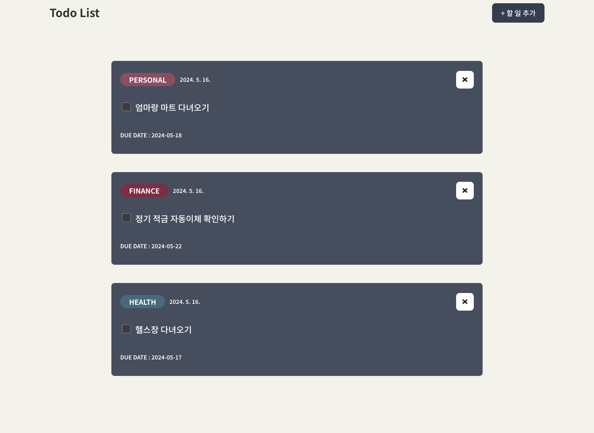
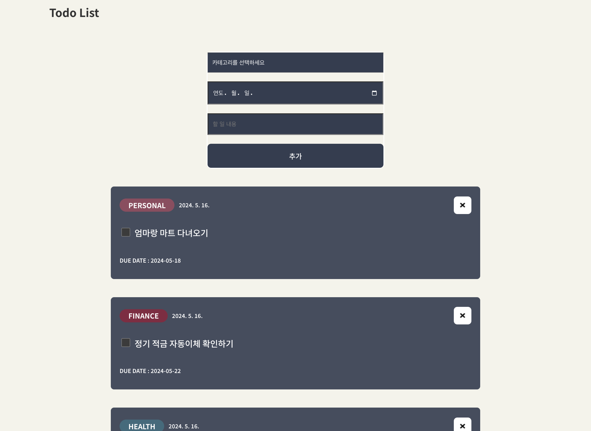
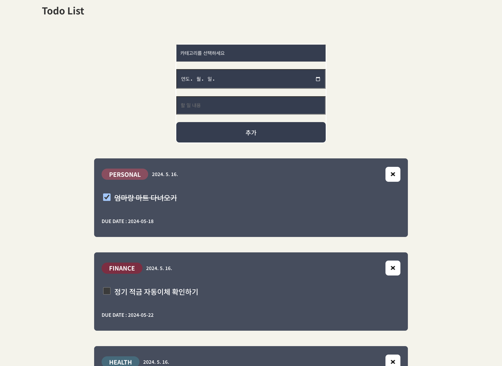

# Todo List 개인 프로젝트

### Todo list를 간편하게 추가하여 한눈에 일정을 확인합니다.

1. 할일 추가 버튼을 클릭하여 리스트를 추가합니다
   

2. 입력창이 나타나면 할일, 마감기한, 할일에 대한 내용을 기입후 추가 버튼을 클릭합니다
   
3. 추가한 리스트는 오른쪽의 삭제버튼을 통해 삭제는 물론, 체크 박스로 완료에 대한 사항을 추가하여 확인 할 수 있게 합니다.
   
